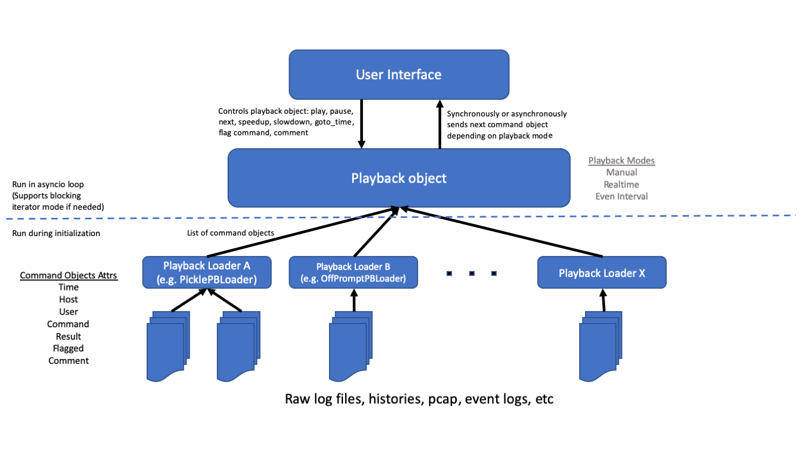

# hsp
hsp is a Python library that allows a user to replay command line sessions for debriefing, instruction, or review.  The main components of hsp are the Loaders (loader.py), the Playback object (playback.py), and the UI (currently hsp.py).

## Primary Features Include:
- Replay command line sessions displaying time, host, user, command, result, analyst comments
- Multiple playback modes: Manual, Realtime, EvenInterval
- Control over playback settings: speed-up/slow-down, play, pause, goto_time, change playback mode
- Extensible loaders to allow quick dev to ingest new file types
- Generic loaders to handle csv and json formatted logs
- UI decoupled from playback object to allow developing new front-ends


## Installation

WARNING: ipython does not play nicely with prompt_toolkit 2.0.  It's recommended to run this in a pyenv or separate vm if you care about ipython

Tested from a clean install of Ubuntu 18.04:
```bash
sudo apt-get install python3
sudo apt-get install python3-pip
pip3 install setuptools
sudo apt-get install git
git clone https://github.com/starksimilarity/hsp.git
cd hsp
sudo python3 setup.py install
```

## Usage
Stand-Alone
```bash
> python3 hsp.py
```

With Docker
```bash
sudo docker build -t hsp .
sudo docker run -it hsp
```

## Module Interactions


## License
[GNU GPLv3](https://www.gnu.org/licenses/gpl-3.0.en.html)
